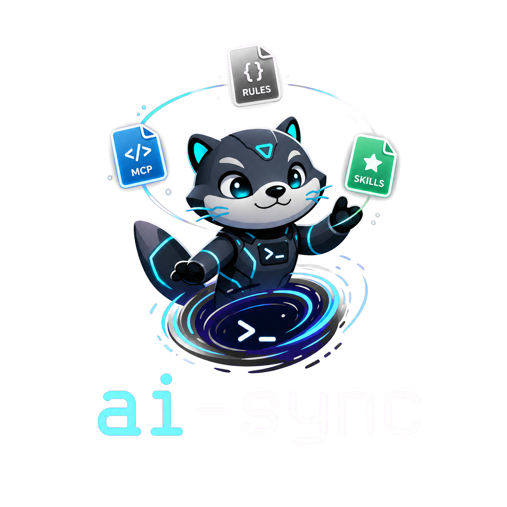

# 🔄 ai-sync

<p align="center">
  
</p>

<p align="center">
  
  
  
</p>

`ai-sync` is a Go CLI that keeps AI-agent configuration in one canonical `.ai/` directory, then generates the files expected by Claude Code, Codex, and Kiro.

Instead of maintaining three separate sets of rules, MCP settings, and skills by hand, you edit `.ai/` once and let `ai-sync` render each agent-specific format.

## ✨ Why use it?

Use `ai-sync` when a repository needs consistent instructions across multiple AI coding agents.

| 🚧 Problem | ✅ What `ai-sync` does |
| --- | --- |
| Claude, Codex, and Kiro each expect different files | Generates the right output files for each target |
| Shared project rules drift between agents | Keeps shared guidance in `.ai/project.md` |
| Agent-specific guidance gets mixed with global rules | Keeps overrides in `.ai/targets/<target>.md` |
| Skills need to be copied into several agent folders | Copies `.ai/skills/` into each target's expected location |
| Generated files can become stale | Uses manifests to prune files it owns safely |

## 📦 Install

```sh
go install github.com/dialguiba/ai-sync/cmd/ai-sync@latest
```

Make sure Go's bin directory is in your `PATH`.

For the current terminal session:

```sh
export PATH="$HOME/go/bin:$PATH"
```

To make it permanent, add the same line to your shell config file:

| Shell | Config file | Command |
| --- | --- | --- |
| zsh | `~/.zshrc` | `echo 'export PATH="$HOME/go/bin:$PATH"' >> ~/.zshrc` |
| bash | `~/.bashrc` | `echo 'export PATH="$HOME/go/bin:$PATH"' >> ~/.bashrc` |
| fish | `~/.config/fish/config.fish` | `fish_add_path $HOME/go/bin` |

Reload your shell config after updating it:

```sh
source ~/.zshrc   # zsh
source ~/.bashrc  # bash
```

For fish, restart the terminal or run:

```fish
source ~/.config/fish/config.fish
```

Check that the CLI is available:

```sh
ai-sync --help
```

Print the `.ai/` authoring convention when you want a human or AI agent to scaffold the canonical source files for an existing project:

```sh
ai-sync convention
```

## 🔼 Update

Update `ai-sync` by running the install command again:

```sh
go install github.com/dialguiba/ai-sync/cmd/ai-sync@latest
```

Verify the installed binary:

```sh
which ai-sync
ai-sync --help
ai-sync version
go version -m "$(which ai-sync)"
```

The module path should point to `github.com/dialguiba/ai-sync`, and `ai-sync version` should match the latest release tag.

Prebuilt binaries are also attached to each GitHub Release for macOS, Linux, and Windows on `amd64` and `arm64`.

## 🚢 Releasing

Maintainers publish a new release by pushing a SemVer tag:

```sh
git tag vX.Y.Z
git push origin vX.Y.Z
```

GitHub Actions runs GoReleaser on `v*` tags and uploads archives plus `checksums.txt` to the GitHub Release.

## ⚡ Quick start

Run these commands inside the repository you want to configure:

```sh
ai-sync init        # create a starter .ai/ directory
ai-sync convention  # print the .ai authoring convention for an AI agent
ai-sync version     # print version and build metadata
ai-sync             # generate Claude, Codex, and Kiro files
ai-sync --dry-run   # preview changes without writing files
ai-sync --response-trace # add an optional per-response context trace rule
ai-sync list        # list generated file paths without writing files
```

Generate only one target when needed:

```sh
ai-sync --target claude
ai-sync --target codex
ai-sync --target kiro
```

Enable the optional response trace rule when you want agents to show what context they loaded for each answer:

```sh
ai-sync --response-trace
ai-sync --target codex --response-trace
ai-sync --dry-run --response-trace
```

By default this rule is off. When enabled, generated base guidance tells agents to include a short `Trace` section listing only context loaded during the current response, such as rules read, skills loaded, files inspected, and tools used. Running `ai-sync` again without `--response-trace` removes the generated trace rule.

## 🧠 Mental model

```txt
You edit this:

.ai/
  project.md
  mcp.yaml
  targets/
    claude.md
    codex.md
    kiro.md
  rules/
    frontend.md
    backend.md
  skills/
    example/
      SKILL.md

ai-sync generates this:

Claude Code  -> CLAUDE.md, .claude/settings.json, .mcp.json, .claude/rules/, .claude/skills/
Codex        -> AGENTS.md, nested */AGENTS.md for scoped rules, .codex/config.toml, .agents/skills/
Kiro         -> .kiro/steering/, .kiro/settings/mcp.json, .kiro/powers/
```

> [!IMPORTANT]
> The rule is simple: **edit `.ai/`, not generated files**.

## 🧾 Generation contract

| Canonical input | Claude Code output | Codex output | Kiro output |
| --- | --- | --- | --- |
| `.ai/project.md` | `CLAUDE.md` shared section | root `AGENTS.md` shared section | `.kiro/steering/project-conventions.md` shared section |
| `.ai/targets/claude.md` | `CLAUDE.md` target-specific section | — | — |
| `.ai/targets/codex.md` | — | root `AGENTS.md` target-specific section | — |
| `.ai/targets/kiro.md` | — | — | `.kiro/steering/project-conventions.md` target-specific section |
| `.ai/rules/<name>.md` | `.claude/rules/<name>.md` with `paths` frontmatter | nested `<scope>/AGENTS.md` files, or root `AGENTS.md` when no narrower directory exists | `.kiro/steering/<name>.md` with `inclusion: fileMatch` |
| `.ai/mcp.yaml` | `.mcp.json` | `.codex/config.toml` | `.kiro/settings/mcp.json` |
| `.ai/skills/<name>/SKILL.md` | `.claude/skills/<name>/SKILL.md` | `.agents/skills/<name>/SKILL.md` | `.kiro/powers/<name>/POWER.md` |
| extra files under `.ai/skills/<name>/` | copied under `.claude/skills/<name>/` | copied under `.agents/skills/<name>/` | copied under `.kiro/powers/<name>/` |

`ai-sync list` prints this generated-file contract for the current repository without writing files. Use `ai-sync list --target codex` when you only want one target.

## 🛠️ Authoring `.ai/`

### 🌍 Shared project guidance

Put repo-wide instructions in `.ai/project.md`.

Good examples:

- 🏗️ stack and architecture conventions
- 🧪 build, test, lint, and verification commands
- 🧼 naming, formatting, and import rules
- 📝 commit conventions
- 👀 review expectations
- 🧾 generated-file ownership rules

Example:

```md
# Project Rules

## Commands

- Run tests with `go test ./...`.
- Format Go code with `gofmt`.

## Conventions

- Use conventional commits.
- Do not edit generated agent files directly; update `.ai/` instead.
```

### 🎯 Target-specific guidance

Use `.ai/targets/<target>.md` only for instructions that apply to one agent.

| 📄 File | 🎯 Use for |
| --- | --- |
| `.ai/targets/claude.md` | Claude Code-specific behavior or wording |
| `.ai/targets/codex.md` | Codex-specific workflow, planning, or review instructions |
| `.ai/targets/kiro.md` | Kiro-specific steering guidance |

If the same rule appears in more than one target file, it probably belongs in `.ai/project.md` instead.

List generated file paths without writing files:

```sh
ai-sync list
ai-sync list --target codex
```

### 🔎 Optional response trace

Use `--response-trace` when you want generated base guidance to ask agents for a compact context receipt before each answer:

```sh
ai-sync --response-trace
```

The trace is intentionally small and per-response only. It should mention what was loaded during the current answer, not the whole conversation history. If no project files were read, the generated instruction tells the agent to say:

```txt
Trace: no project files read.
```

This feature is disabled by default so teams can choose whether the extra visibility is worth the small token cost.

### 🧭 Path-scoped rules

Use `.ai/rules/<name>.md` for guidance that should apply only to specific files or directories. Each rule file must start with YAML frontmatter containing a `paths` list.

Example `.ai/rules/frontend.md`:

```md
---
paths:
  - "frontend/**"
  - "src/**/*.tsx"
---

# Frontend Rules

- Use atomic design for UI components.
- Keep container logic separate from presentational components.
```

`ai-sync` maps these rules to each target's strongest supported mechanism:

| Target | Generated output |
| --- | --- |
| Claude Code | `.claude/rules/<name>.md` with `paths` frontmatter |
| Kiro | `.kiro/steering/<name>.md` with `inclusion: fileMatch` and `fileMatchPattern` |
| Codex | Root `AGENTS.md` for base guidance plus nested `<scope>/AGENTS.md` files for path-scoped rules |

For Codex, `ai-sync` maps each glob to the nearest stable directory before the first glob segment. For example, `frontend/**` generates `frontend/AGENTS.md`, and `src/**/*.tsx` generates `src/AGENTS.md`. Root-only patterns such as `*.go` stay in the root `AGENTS.md` because Codex has no more specific directory to attach them to.

### 🔌 MCP servers

Define shared MCP servers in `.ai/mcp.yaml`:

```yaml
servers:
  playwright:
    command: npx
    args:
      - -y
      - '@playwright/mcp@latest'
    env:
      PLAYWRIGHT_HEADLESS: "true"
```

`ai-sync` maps that config to each agent's expected file:

| 🧩 Canonical source | Claude | Codex | Kiro |
| --- | --- | --- | --- |
| `.ai/mcp.yaml` | `.mcp.json` | `.codex/config.toml` | `.kiro/settings/mcp.json` |

> [!WARNING]
> Do not put secrets directly in `.ai/mcp.yaml`. Reference environment variables instead.

### 🧰 Skills

Put reusable workflows in `.ai/skills/<name>/SKILL.md`:

```txt
.ai/skills/playwright-cli/
  SKILL.md
  scripts/
  references/
  assets/
```

Example `SKILL.md`:

```md
---
name: "playwright-cli"
description: "Use when browser automation or Playwright CLI validation is needed."
---

# Playwright CLI

1. Inspect the app route before writing tests.
2. Prefer stable selectors.
3. Capture screenshots only when they help debugging.
```

Generated mapping:

| 📥 Source | 📤 Generated output |
| --- | --- |
| `.ai/skills/<name>/SKILL.md` | `.claude/skills/<name>/SKILL.md` |
| `.ai/skills/<name>/SKILL.md` | `.agents/skills/<name>/SKILL.md` |
| `.ai/skills/<name>/SKILL.md` | `.kiro/powers/<name>/POWER.md` |

Supporting files inside the skill folder are copied too.

## 🧾 Generated ownership

`ai-sync` writes generated headers and manifest files for generated directories it manages, including skills, Claude rules, Codex scoped `AGENTS.md` files, Kiro steering files, and Kiro Powers.

Those manifests let the CLI prune stale generated files without deleting user-owned files added manually inside generated folders.

Practical rule:

- ✅ Files listed in `.ai-sync-manifest` or `.codex/scoped-agents-manifest` are owned by `ai-sync`
- 🛡️ Files you add manually but that are not listed in the manifest are preserved
- ⚠️ If `ai-sync` is about to overwrite an existing output file without an ai-sync generated marker, it prints a warning before writing it

## 👨‍💻 Local development

Use this flow when working on `ai-sync` itself:

```sh
git clone git@github.com-home:dialguiba/ai-sync.git
cd ai-sync
go test ./...
go run ./cmd/ai-sync --help
```

Run the CLI from source:

```sh
go run ./cmd/ai-sync init
go run ./cmd/ai-sync
go run ./cmd/ai-sync --target codex
go run ./cmd/ai-sync --dry-run
go run ./cmd/ai-sync list
```

## 🚧 Current limitations

Kiro Powers are generated as valid importable folders. `ai-sync` does not install or register them in the local Kiro app.

Codex scoped rules are directory-based, not full glob-based. When a glob has no stable directory prefix, the rule is kept in the root `AGENTS.md` as the safest available Codex scope.
